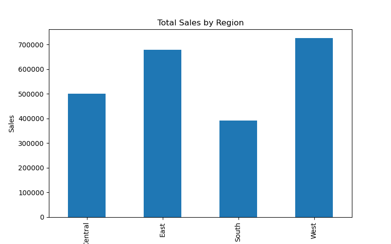
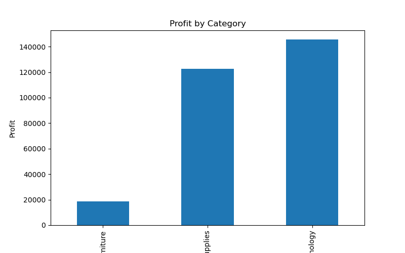
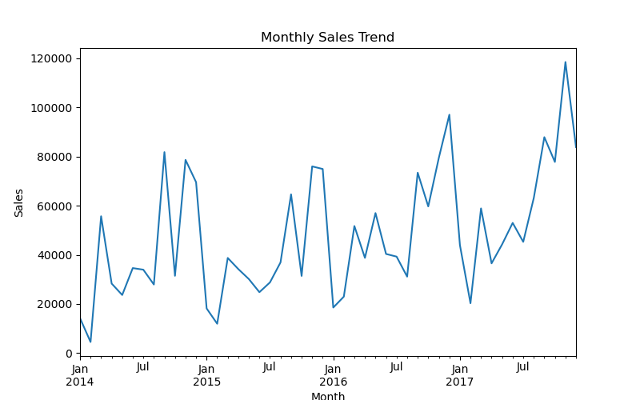

# Data Analytics Portfolio – Paramita Kar

This repository contains my data analytics portfolio projects using SQL, Python, and data visualization tools such as Power BI and Tableau.

## Projects

### 1. Retail Sales Analysis
Tools: Python, Pandas, Matplotlib

### 2. Customer Segmentation Analysis
Tools: SQL, Python, Pandas

---

## Retail Sales Analysis – Portfolio Project (Tools used: PYTHON)

This project analyzes a retail sales dataset to explore revenue trends and product performance.

Key analysis performed:
- Sales comparison across regions
- Profit analysis by product category
- Monthly sales trend analysis

### Visualizations

### SQL Sales Analysis - Portfolio Project (Tool Used: MySqlWorkbench)

Business analysis using SQL queries on retail sales data including:
- sales by region
- profit by category
- running sales totals
- customer revenue analysis

- ---

## Customer Segmentation Analysis – Portfolio Project (Tools used: PYTHON)

This project analyzes customer purchase behavior to identify high-value, medium-value, and low-value customers based on total revenue generated.

Key analysis performed:

- Total revenue generated by each customer  
- Identification of top revenue-generating customers  
- Customer segmentation into **High Value, Medium Value, and Low Value** groups  
- Revenue contribution by each customer segment  

### Visualizations

---

### SQL Customer Segmentation – Portfolio Project (Tool Used: MySQLWorkbench)

Business analysis using SQL queries on customer purchase data including:

- total revenue per customer  
- ranking customers based on sales  
- customer segmentation using **NTILE window function**  
- revenue contribution by customer segments
